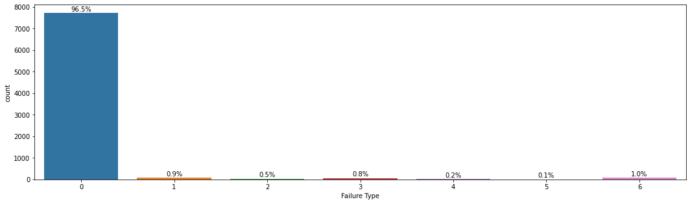
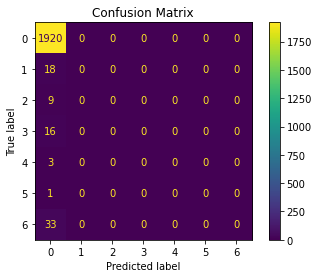
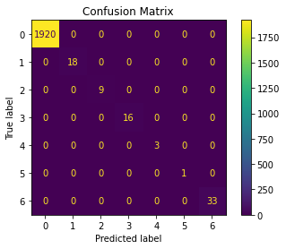

# Import Library - Model Building

pandas is a library for data manipulation and analysis. It provides data structures and data analysis tools for handling and manipulating numerical tables and time series data.
numpy is a library for the Python programming language, adding support for large, multi-dimensional arrays and matrices, along with a large collection of high-level mathematical functions to operate on these arrays.
seaborn is a library for statistical data visualization built on top of matplotlib. It provides a high-level interface for drawing attractive and informative statistical graphics.
matplotlib is a plotting library for the Python programming language and its numerical mathematics extension NumPy. It provides an object-oriented API for embedding plots into applications using general-purpose GUI toolkits like Tkinter, wxPython, Qt, or GTK.


```python
import pandas as pd
import numpy as np
import seaborn as sns
import matplotlib.pyplot as plt
```

Read the dataset


```python
df = pd.read_csv('./data.csv')
```

Displaying starting 20 rows


```python
df.head(20)
```


<div>
<style scoped>
    .dataframe tbody tr th:only-of-type {
        vertical-align: middle;
    }

    .dataframe tbody tr th {
        vertical-align: top;
    }

    .dataframe thead th {
        text-align: right;
    }
</style>
<table border="1" class="dataframe">
  <thead>
    <tr style="text-align: right;">
      <th></th>
      <th>Unnamed: 0</th>
      <th>Type</th>
      <th>Air temperature [°C]</th>
      <th>Process temperature [°C]</th>
      <th>Rotational speed [rpm]</th>
      <th>Torque [Nm]</th>
      <th>Tool wear [min]</th>
      <th>Machine failure</th>
      <th>TWF</th>
      <th>HDF</th>
      <th>PWF</th>
      <th>OSF</th>
      <th>RNF</th>
      <th>Temperature difference [°C]</th>
    </tr>
  </thead>
  <tbody>
    <tr>
      <th>0</th>
      <td>0</td>
      <td>M</td>
      <td>25.95</td>
      <td>36.45</td>
      <td>1551</td>
      <td>42.8</td>
      <td>0</td>
      <td>0</td>
      <td>0</td>
      <td>0</td>
      <td>0</td>
      <td>0</td>
      <td>0</td>
      <td>10.5</td>
    </tr>
    <tr>
      <th>1</th>
      <td>1</td>
      <td>L</td>
      <td>26.05</td>
      <td>36.55</td>
      <td>1408</td>
      <td>46.3</td>
      <td>3</td>
      <td>0</td>
      <td>0</td>
      <td>0</td>
      <td>0</td>
      <td>0</td>
      <td>0</td>
      <td>10.5</td>
    </tr>
    <tr>
      <th>2</th>
      <td>2</td>
      <td>L</td>
      <td>25.95</td>
      <td>36.35</td>
      <td>1498</td>
      <td>49.4</td>
      <td>5</td>
      <td>0</td>
      <td>0</td>
      <td>0</td>
      <td>0</td>
      <td>0</td>
      <td>0</td>
      <td>10.4</td>
    </tr>
    <tr>
      <th>3</th>
      <td>3</td>
      <td>L</td>
      <td>26.05</td>
      <td>36.45</td>
      <td>1433</td>
      <td>39.5</td>
      <td>7</td>
      <td>0</td>
      <td>0</td>
      <td>0</td>
      <td>0</td>
      <td>0</td>
      <td>0</td>
      <td>10.4</td>
    </tr>
    <tr>
      <th>4</th>
      <td>4</td>
      <td>L</td>
      <td>26.05</td>
      <td>36.55</td>
      <td>1408</td>
      <td>40.0</td>
      <td>9</td>
      <td>0</td>
      <td>0</td>
      <td>0</td>
      <td>0</td>
      <td>0</td>
      <td>0</td>
      <td>10.5</td>
    </tr>
    <tr>
      <th>5</th>
      <td>5</td>
      <td>M</td>
      <td>25.95</td>
      <td>36.45</td>
      <td>1425</td>
      <td>41.9</td>
      <td>11</td>
      <td>0</td>
      <td>0</td>
      <td>0</td>
      <td>0</td>
      <td>0</td>
      <td>0</td>
      <td>10.5</td>
    </tr>
    <tr>
      <th>6</th>
      <td>6</td>
      <td>L</td>
      <td>25.95</td>
      <td>36.45</td>
      <td>1558</td>
      <td>42.4</td>
      <td>14</td>
      <td>0</td>
      <td>0</td>
      <td>0</td>
      <td>0</td>
      <td>0</td>
      <td>0</td>
      <td>10.5</td>
    </tr>
    <tr>
      <th>7</th>
      <td>7</td>
      <td>L</td>
      <td>25.95</td>
      <td>36.45</td>
      <td>1527</td>
      <td>40.2</td>
      <td>16</td>
      <td>0</td>
      <td>0</td>
      <td>0</td>
      <td>0</td>
      <td>0</td>
      <td>0</td>
      <td>10.5</td>
    </tr>
    <tr>
      <th>8</th>
      <td>8</td>
      <td>M</td>
      <td>26.15</td>
      <td>36.55</td>
      <td>1667</td>
      <td>28.6</td>
      <td>18</td>
      <td>0</td>
      <td>0</td>
      <td>0</td>
      <td>0</td>
      <td>0</td>
      <td>0</td>
      <td>10.4</td>
    </tr>
    <tr>
      <th>9</th>
      <td>9</td>
      <td>M</td>
      <td>26.35</td>
      <td>36.85</td>
      <td>1741</td>
      <td>28.0</td>
      <td>21</td>
      <td>0</td>
      <td>0</td>
      <td>0</td>
      <td>0</td>
      <td>0</td>
      <td>0</td>
      <td>10.5</td>
    </tr>
    <tr>
      <th>10</th>
      <td>10</td>
      <td>H</td>
      <td>26.25</td>
      <td>36.75</td>
      <td>1782</td>
      <td>23.9</td>
      <td>24</td>
      <td>0</td>
      <td>0</td>
      <td>0</td>
      <td>0</td>
      <td>0</td>
      <td>0</td>
      <td>10.5</td>
    </tr>
    <tr>
      <th>11</th>
      <td>11</td>
      <td>H</td>
      <td>26.45</td>
      <td>36.95</td>
      <td>1423</td>
      <td>44.3</td>
      <td>29</td>
      <td>0</td>
      <td>0</td>
      <td>0</td>
      <td>0</td>
      <td>0</td>
      <td>0</td>
      <td>10.5</td>
    </tr>
    <tr>
      <th>12</th>
      <td>12</td>
      <td>M</td>
      <td>26.45</td>
      <td>36.95</td>
      <td>1339</td>
      <td>51.1</td>
      <td>34</td>
      <td>0</td>
      <td>0</td>
      <td>0</td>
      <td>0</td>
      <td>0</td>
      <td>0</td>
      <td>10.5</td>
    </tr>
    <tr>
      <th>13</th>
      <td>13</td>
      <td>M</td>
      <td>26.45</td>
      <td>37.05</td>
      <td>1742</td>
      <td>30.0</td>
      <td>37</td>
      <td>0</td>
      <td>0</td>
      <td>0</td>
      <td>0</td>
      <td>0</td>
      <td>0</td>
      <td>10.6</td>
    </tr>
    <tr>
      <th>14</th>
      <td>14</td>
      <td>L</td>
      <td>26.45</td>
      <td>37.05</td>
      <td>2035</td>
      <td>19.6</td>
      <td>40</td>
      <td>0</td>
      <td>0</td>
      <td>0</td>
      <td>0</td>
      <td>0</td>
      <td>0</td>
      <td>10.6</td>
    </tr>
    <tr>
      <th>15</th>
      <td>15</td>
      <td>L</td>
      <td>26.45</td>
      <td>37.05</td>
      <td>1542</td>
      <td>48.4</td>
      <td>42</td>
      <td>0</td>
      <td>0</td>
      <td>0</td>
      <td>0</td>
      <td>0</td>
      <td>0</td>
      <td>10.6</td>
    </tr>
    <tr>
      <th>16</th>
      <td>16</td>
      <td>M</td>
      <td>26.45</td>
      <td>37.05</td>
      <td>1311</td>
      <td>46.6</td>
      <td>44</td>
      <td>0</td>
      <td>0</td>
      <td>0</td>
      <td>0</td>
      <td>0</td>
      <td>0</td>
      <td>10.6</td>
    </tr>
    <tr>
      <th>17</th>
      <td>17</td>
      <td>M</td>
      <td>26.55</td>
      <td>37.05</td>
      <td>1410</td>
      <td>45.6</td>
      <td>47</td>
      <td>0</td>
      <td>0</td>
      <td>0</td>
      <td>0</td>
      <td>0</td>
      <td>0</td>
      <td>10.5</td>
    </tr>
    <tr>
      <th>18</th>
      <td>18</td>
      <td>H</td>
      <td>26.65</td>
      <td>37.05</td>
      <td>1306</td>
      <td>54.5</td>
      <td>50</td>
      <td>0</td>
      <td>0</td>
      <td>0</td>
      <td>0</td>
      <td>0</td>
      <td>0</td>
      <td>10.4</td>
    </tr>
    <tr>
      <th>19</th>
      <td>19</td>
      <td>M</td>
      <td>26.75</td>
      <td>37.15</td>
      <td>1632</td>
      <td>32.5</td>
      <td>55</td>
      <td>0</td>
      <td>0</td>
      <td>0</td>
      <td>0</td>
      <td>0</td>
      <td>0</td>
      <td>10.4</td>
    </tr>
  </tbody>
</table>
</div>


This is a piece of code that is using the pandas library to call the value_counts() method on the 'Type' column of a DataFrame named 'df'.
It returns the frequency of unique values in the 'Type' column, with the most frequent value appearing first.
This code snippet will output the number of occurrences of each unique value in the 'Type' column of the DataFrame 'df'.


```python
df['Type'].value_counts()
```


    L    6000
    M    2997
    H    1003
    Name: Type, dtype: int64


```python
df['Machine failure'].value_counts()
```


    0    9661
    1     339
    Name: Machine failure, dtype: int64


```python

```

This is a Python function named "add_class" which takes one parameter "data" which is a pandas DataFrame.
This function checks the value of several columns in the dataframe and based on the value of that column return a number.
The function checks for the value of columns 'TWF', 'HDF', 'PWF', 'OSF', 'RNF' and 'Machine failure' and if the value is 1 then it returns 1, 2, 3, 4, 5 and 0 respectively.
It appears that the first if statement is commented out and not executed.
This function can be used to assign a class label to each row in the dataframe based on the values in certain columns.


```python
def add_class(data):
    #if data['Machine failure']==1:
        #return 0
    if data['TWF']==1:
        return 1
    if data['HDF']==1:
        return 2
    if data['PWF']==1:
        return 3
    if data['OSF']==1:
        return 4
    if data['RNF']==1:
        return 5
    if data['Machine failure']==1:
        return 0
```

This is a line of code that applies the function add_class to each row of the dataframe df. It creates a new column in the dataframe named 'Failure Type' and assigns the output of the function to each row. The axis=1 parameter is used to indicate that the function should be applied to each row, rather than each column.
The function checks the values of several columns in the dataframe and assigns a class label based on those values. In this case, it assigns a class label of 0, 1, 2, 3, 4, 5 to each row of the dataframe based on the values of columns 'TWF', 'HDF', 'PWF', 'OSF', 'RNF' and 'Machine failure' respectively.


```python
df['Failure Type'] = df.apply(add_class,axis=1)
df
```


<div>
<style scoped>
    .dataframe tbody tr th:only-of-type {
        vertical-align: middle;
    }

    .dataframe tbody tr th {
        vertical-align: top;
    }

    .dataframe thead th {
        text-align: right;
    }
</style>
<table border="1" class="dataframe">
  <thead>
    <tr style="text-align: right;">
      <th></th>
      <th>Unnamed: 0</th>
      <th>Type</th>
      <th>Air temperature [°C]</th>
      <th>Process temperature [°C]</th>
      <th>Rotational speed [rpm]</th>
      <th>Torque [Nm]</th>
      <th>Tool wear [min]</th>
      <th>Machine failure</th>
      <th>TWF</th>
      <th>HDF</th>
      <th>PWF</th>
      <th>OSF</th>
      <th>RNF</th>
      <th>Temperature difference [°C]</th>
      <th>Failure Type</th>
    </tr>
  </thead>
  <tbody>
    <tr>
      <th>0</th>
      <td>0</td>
      <td>M</td>
      <td>25.95</td>
      <td>36.45</td>
      <td>1551</td>
      <td>42.8</td>
      <td>0</td>
      <td>0</td>
      <td>0</td>
      <td>0</td>
      <td>0</td>
      <td>0</td>
      <td>0</td>
      <td>10.5</td>
      <td>NaN</td>
    </tr>
    <tr>
      <th>1</th>
      <td>1</td>
      <td>L</td>
      <td>26.05</td>
      <td>36.55</td>
      <td>1408</td>
      <td>46.3</td>
      <td>3</td>
      <td>0</td>
      <td>0</td>
      <td>0</td>
      <td>0</td>
      <td>0</td>
      <td>0</td>
      <td>10.5</td>
      <td>NaN</td>
    </tr>
    <tr>
      <th>2</th>
      <td>2</td>
      <td>L</td>
      <td>25.95</td>
      <td>36.35</td>
      <td>1498</td>
      <td>49.4</td>
      <td>5</td>
      <td>0</td>
      <td>0</td>
      <td>0</td>
      <td>0</td>
      <td>0</td>
      <td>0</td>
      <td>10.4</td>
      <td>NaN</td>
    </tr>
    <tr>
      <th>3</th>
      <td>3</td>
      <td>L</td>
      <td>26.05</td>
      <td>36.45</td>
      <td>1433</td>
      <td>39.5</td>
      <td>7</td>
      <td>0</td>
      <td>0</td>
      <td>0</td>
      <td>0</td>
      <td>0</td>
      <td>0</td>
      <td>10.4</td>
      <td>NaN</td>
    </tr>
    <tr>
      <th>4</th>
      <td>4</td>
      <td>L</td>
      <td>26.05</td>
      <td>36.55</td>
      <td>1408</td>
      <td>40.0</td>
      <td>9</td>
      <td>0</td>
      <td>0</td>
      <td>0</td>
      <td>0</td>
      <td>0</td>
      <td>0</td>
      <td>10.5</td>
      <td>NaN</td>
    </tr>
    <tr>
      <th>...</th>
      <td>...</td>
      <td>...</td>
      <td>...</td>
      <td>...</td>
      <td>...</td>
      <td>...</td>
      <td>...</td>
      <td>...</td>
      <td>...</td>
      <td>...</td>
      <td>...</td>
      <td>...</td>
      <td>...</td>
      <td>...</td>
      <td>...</td>
    </tr>
    <tr>
      <th>9995</th>
      <td>9995</td>
      <td>M</td>
      <td>26.65</td>
      <td>36.25</td>
      <td>1604</td>
      <td>29.5</td>
      <td>14</td>
      <td>0</td>
      <td>0</td>
      <td>0</td>
      <td>0</td>
      <td>0</td>
      <td>0</td>
      <td>9.6</td>
      <td>NaN</td>
    </tr>
    <tr>
      <th>9996</th>
      <td>9996</td>
      <td>H</td>
      <td>26.75</td>
      <td>36.25</td>
      <td>1632</td>
      <td>31.8</td>
      <td>17</td>
      <td>0</td>
      <td>0</td>
      <td>0</td>
      <td>0</td>
      <td>0</td>
      <td>0</td>
      <td>9.5</td>
      <td>NaN</td>
    </tr>
    <tr>
      <th>9997</th>
      <td>9997</td>
      <td>M</td>
      <td>26.85</td>
      <td>36.45</td>
      <td>1645</td>
      <td>33.4</td>
      <td>22</td>
      <td>0</td>
      <td>0</td>
      <td>0</td>
      <td>0</td>
      <td>0</td>
      <td>0</td>
      <td>9.6</td>
      <td>NaN</td>
    </tr>
    <tr>
      <th>9998</th>
      <td>9998</td>
      <td>H</td>
      <td>26.85</td>
      <td>36.55</td>
      <td>1408</td>
      <td>48.5</td>
      <td>25</td>
      <td>0</td>
      <td>0</td>
      <td>0</td>
      <td>0</td>
      <td>0</td>
      <td>0</td>
      <td>9.7</td>
      <td>NaN</td>
    </tr>
    <tr>
      <th>9999</th>
      <td>9999</td>
      <td>M</td>
      <td>26.85</td>
      <td>36.55</td>
      <td>1500</td>
      <td>40.2</td>
      <td>30</td>
      <td>0</td>
      <td>0</td>
      <td>0</td>
      <td>0</td>
      <td>0</td>
      <td>0</td>
      <td>9.7</td>
      <td>NaN</td>
    </tr>
  </tbody>
</table>
<p>10000 rows × 15 columns</p>
</div>


```python
df['Failure Type'].value_counts()
```


    2.0    115
    3.0     91
    4.0     78
    1.0     46
    5.0     18
    0.0      9
    Name: Failure Type, dtype: int64


category_encoders' library to encode the 'Type' and 'Failure Type' columns of the DataFrame 'df' as ordinal values.

import category_encoders as ce is importing the 'category_encoders' library which is a set of efficient, well-tested and easy-to-use encoders for various types of categorical data.

encoder = ce.OrdinalEncoder(cols=['Type','Failure Type']) is initializing an ordinal encoder and specifying that it should be applied to the 'Type' and 'Failure Type' columns of the DataFrame. Ordinal encoding is a method of encoding categorical variables as integers.

df = encoder.fit_transform(df) applies the encoder to the DataFrame and returns the encoded DataFrame.

df.head() returns the first 5 rows of the encoded DataFrame, allowing you to quickly see how the encoding has affected the DataFrame.

The purpose of this script is to encode the categorical variables 'Type' and 'Failure Type' as numerical values for further analysis or modeling. The OrdinalEncoder function assigns a unique integer to each unique category, this way, the algorithms will treat them as numerical variables.


```python
import category_encoders as ce
encoder = ce.OrdinalEncoder(cols=['Type','Failure Type'])
df = encoder.fit_transform(df)
df.head()
```


<div>
<style scoped>
    .dataframe tbody tr th:only-of-type {
        vertical-align: middle;
    }

    .dataframe tbody tr th {
        vertical-align: top;
    }

    .dataframe thead th {
        text-align: right;
    }
</style>
<table border="1" class="dataframe">
  <thead>
    <tr style="text-align: right;">
      <th></th>
      <th>Unnamed: 0</th>
      <th>Type</th>
      <th>Air temperature [°C]</th>
      <th>Process temperature [°C]</th>
      <th>Rotational speed [rpm]</th>
      <th>Torque [Nm]</th>
      <th>Tool wear [min]</th>
      <th>Machine failure</th>
      <th>TWF</th>
      <th>HDF</th>
      <th>PWF</th>
      <th>OSF</th>
      <th>RNF</th>
      <th>Temperature difference [°C]</th>
      <th>Failure Type</th>
    </tr>
  </thead>
  <tbody>
    <tr>
      <th>0</th>
      <td>0</td>
      <td>1</td>
      <td>25.95</td>
      <td>36.45</td>
      <td>1551</td>
      <td>42.8</td>
      <td>0</td>
      <td>0</td>
      <td>0</td>
      <td>0</td>
      <td>0</td>
      <td>0</td>
      <td>0</td>
      <td>10.5</td>
      <td>1</td>
    </tr>
    <tr>
      <th>1</th>
      <td>1</td>
      <td>2</td>
      <td>26.05</td>
      <td>36.55</td>
      <td>1408</td>
      <td>46.3</td>
      <td>3</td>
      <td>0</td>
      <td>0</td>
      <td>0</td>
      <td>0</td>
      <td>0</td>
      <td>0</td>
      <td>10.5</td>
      <td>1</td>
    </tr>
    <tr>
      <th>2</th>
      <td>2</td>
      <td>2</td>
      <td>25.95</td>
      <td>36.35</td>
      <td>1498</td>
      <td>49.4</td>
      <td>5</td>
      <td>0</td>
      <td>0</td>
      <td>0</td>
      <td>0</td>
      <td>0</td>
      <td>0</td>
      <td>10.4</td>
      <td>1</td>
    </tr>
    <tr>
      <th>3</th>
      <td>3</td>
      <td>2</td>
      <td>26.05</td>
      <td>36.45</td>
      <td>1433</td>
      <td>39.5</td>
      <td>7</td>
      <td>0</td>
      <td>0</td>
      <td>0</td>
      <td>0</td>
      <td>0</td>
      <td>0</td>
      <td>10.4</td>
      <td>1</td>
    </tr>
    <tr>
      <th>4</th>
      <td>4</td>
      <td>2</td>
      <td>26.05</td>
      <td>36.55</td>
      <td>1408</td>
      <td>40.0</td>
      <td>9</td>
      <td>0</td>
      <td>0</td>
      <td>0</td>
      <td>0</td>
      <td>0</td>
      <td>0</td>
      <td>10.5</td>
      <td>1</td>
    </tr>
  </tbody>
</table>
</div>


```python
df['Failure Type'].value_counts()
```


    1    9643
    7     115
    2      91
    4      78
    3      46
    5      18
    6       9
    Name: Failure Type, dtype: int64


from sklearn.preprocessing import LabelEncoder imports the 'LabelEncoder' class from the 'sklearn.preprocessing' module which is used to encode categorical variables as integers.

scaler = LabelEncoder() creates an instance of the 'LabelEncoder' class.

df['Failure Type'] = scaler.fit_transform(df['Failure Type']) applies the encoder to the 'Failure Type' column of the DataFrame and returns the encoded column. It first fits the encoder on the column and then transforms it.


```python
from sklearn.preprocessing import LabelEncoder
scaler = LabelEncoder()
df['Failure Type'] = scaler.fit_transform(df['Failure Type'])
```


```python
df['Failure Type'].value_counts()
```


    0    9643
    6     115
    1      91
    3      78
    2      46
    4      18
    5       9
    Name: Failure Type, dtype: int64


X = df.drop(columns='Failure Type' , axis=1) creates a new variable 'X' which contains all the columns of the dataframe 'df' except the 'Failure Type' column. The drop() function is used to remove the 'Failure Type' column from the DataFrame and the axis=1 parameter specifies that the column should be dropped.

y = df['Failure Type'] creates a new variable 'y' which contains the 'Failure Type' column of the dataframe 'df'.


```python
X = df.drop(columns='Failure Type' , axis=1)
y = df['Failure Type']
```

from sklearn.model_selection import train_test_split imports the 'train_test_split' function from the 'sklearn.model_selection' module which is used to split the data into training and testing sets.

X_train,X_test,y_train,y_test = train_test_split(X,y,test_size=0.2,random_state=21) is using the 'train_test_split' function to split the data into training and testing sets. The function takes four parameters as input:

X which is the independent variables dataframe,
y which is the dependent variables dataframe,
test_size which is the proportion of the data that should be allocated to the test set (0.2 in this case, meaning 20% of the data is allocated to the test set),
random_state which is used for initializing the random number generator,
and returns four variables:
X_train which is the training set of independent variables,
X_test which is the testing set of independent variables,
y_train which is the training set of dependent variables,
y_test which is the testing set of dependent variables.


```python
from sklearn.model_selection import train_test_split
X_train,X_test,y_train,y_test = train_test_split(X,y,test_size=0.2,random_state=21)
```

plt.figure(figsize=(18,5)) creates a new figure with a width of 18 inches and a height of 5 inches.

ax = sns.countplot(x = y_train, palette = 'tab10') creates a bar chart using the 'countplot' function from the 'seaborn' library, which counts the occurrences of each unique value in the 'y_train' variable and plots it as a bar chart. It takes two parameters:

x which is the variable to be plotted, in this case 'y_train',
palette which is the color scheme used for the bars, in this case 'tab10'
t= len(y_train) is saving the length of 'y_train' in a variable 't'

for p in ax.patches: is looping through each bar of the chart

percentage = f'{100 * p.get_height() / t:.1f}%\n' calculates the percentage of the total data that each bar represents and saves it in a variable 'percentage'

x = p.get_x() + p.get_width() / 2 and y = p.get_height() is getting the x and y coordinates of the center of the bar

ax.annotate(percentage, (x, y), ha='center', va='center') is adding the 'percentage' variable as an annotation on each bar

plt.show() is showing the chart


```python
plt.figure(figsize=(18,5))
ax = sns.countplot(x = y_train, palette = 'tab10')
t= len(y_train)
for p in ax.patches:
    percentage = f'{100 * p.get_height() / t:.1f}%\n'
    x = p.get_x() + p.get_width() / 2
    y = p.get_height()
    ax.annotate(percentage, (x, y), ha='center', va='center')
plt.show()
```


    

    


import warnings imports the 'warnings' library which provides a way to handle warnings.

warnings.filterwarnings("ignore") sets a filter to ignore all warnings. This means that any warning message that would normally be printed to the console will be suppressed, and not shown to the user.


```python
import warnings
warnings.filterwarnings("ignore")
```

from sklearn.metrics import accuracy_score,classification_report,confusion_matrix,plot_confusion_matrix imports a set of metrics functions from the 'sklearn.metrics' module that will be used to evaluate the model's performance:

accuracy_score is used to calculate the accuracy of the model
classification_report is used to generate a report that includes precision, recall, f1-score, and support for each class
confusion_matrix is used to create a matrix that shows the number of true positives, true negatives, false positives, and false negatives for each class
plot_confusion_matrix is used to create a visual representation of the confusion matrix
from sklearn.linear_model import LogisticRegression imports the 'LogisticRegression' class from the 'sklearn.linear_model' module.

logreg = LogisticRegression() creates an instance of the 'LogisticRegression' class.

logreg.fit(X_train, y_train) trains the logistic regression model using the training data set (X_train, y_train)

y_pred_lr = logreg.predict(X_test) uses the trained model to predict the classes of the test data set (X_test)


```python
from sklearn.metrics import accuracy_score,classification_report,confusion_matrix,plot_confusion_matrix

# Logistic Regression
from sklearn.linear_model import LogisticRegression
logreg = LogisticRegression()
logreg.fit(X_train, y_train)
y_pred_lr = logreg.predict(X_test)

log_train = round(logreg.score(X_train, y_train) * 100, 2)
log_accuracy = round(accuracy_score(y_pred_lr, y_test) * 100, 2)


print("Training Accuracy    :",log_train ,"%")
print("Model Accuracy Score :",log_accuracy ,"%")
print("\033[1m--------------------------------------------------------\033[0m")
print("Classification_Report: \n",classification_report(y_test,y_pred_lr))
print("\033[1m--------------------------------------------------------\033[0m")
plot_confusion_matrix(logreg, X_test, y_test);
plt.title('Confusion Matrix');
```

    Training Accuracy    : 96.54 %
    Model Accuracy Score : 96.0 %
    --------------------------------------------------------
    Classification_Report: 
                   precision    recall  f1-score   support
    
               0       0.96      1.00      0.98      1920
               1       0.00      0.00      0.00        18
               2       0.00      0.00      0.00         9
               3       0.00      0.00      0.00        16
               4       0.00      0.00      0.00         3
               5       0.00      0.00      0.00         1
               6       0.00      0.00      0.00        33
    
        accuracy                           0.96      2000
       macro avg       0.14      0.14      0.14      2000
    weighted avg       0.92      0.96      0.94      2000
    
    --------------------------------------------------------


    

    


```python
# Decision Tree
from sklearn.tree import DecisionTreeClassifier
decision = DecisionTreeClassifier()
decision.fit(X_train, y_train)
y_pred_dec = decision.predict(X_test)

decision_train = round(decision.score(X_train, y_train) * 100, 2)
decision_accuracy = round(accuracy_score(y_pred_dec, y_test) * 100, 2)

print("Training Accuracy    :",decision_train ,"%")
print("Model Accuracy Score :",decision_accuracy ,"%")
print("\033[1m--------------------------------------------------------\033[0m")
print("Classification_Report: \n",classification_report(y_test,y_pred_dec))
print("\033[1m--------------------------------------------------------\033[0m")
plot_confusion_matrix(decision, X_test, y_test);
plt.title('Confusion Matrix');
```

    Training Accuracy    : 100.0 %
    Model Accuracy Score : 100.0 %
    --------------------------------------------------------
    Classification_Report: 
                   precision    recall  f1-score   support
    
               0       1.00      1.00      1.00      1920
               1       1.00      1.00      1.00        18
               2       1.00      1.00      1.00         9
               3       1.00      1.00      1.00        16
               4       1.00      1.00      1.00         3
               5       1.00      1.00      1.00         1
               6       1.00      1.00      1.00        33
    
        accuracy                           1.00      2000
       macro avg       1.00      1.00      1.00      2000
    weighted avg       1.00      1.00      1.00      2000
    
    --------------------------------------------------------


    

    


```python
# Random Forest
from sklearn.ensemble import RandomForestClassifier
random_forest = RandomForestClassifier(n_estimators=100)
random_forest.fit(X_train, y_train)
y_pred_rf = random_forest.predict(X_test)
random_forest.score(X_train, y_train)

random_forest_train = round(random_forest.score(X_train, y_train) * 100, 2)
random_forest_accuracy = round(accuracy_score(y_pred_rf, y_test) * 100, 2)

print("Training Accuracy    :",random_forest_train ,"%")
print("Model Accuracy Score :",random_forest_accuracy ,"%")
print("\033[1m--------------------------------------------------------\033[0m")
print("Classification_Report: \n",classification_report(y_test,y_pred_rf))
print("\033[1m--------------------------------------------------------\033[0m")
plot_confusion_matrix(random_forest, X_test, y_test);
plt.title('Confusion Matrix');
```

    Training Accuracy    : 100.0 %
    Model Accuracy Score : 100.0 %
    --------------------------------------------------------
    Classification_Report: 
                   precision    recall  f1-score   support
    
               0       1.00      1.00      1.00      1920
               1       1.00      1.00      1.00        18
               2       1.00      1.00      1.00         9
               3       1.00      1.00      1.00        16
               4       1.00      1.00      1.00         3
               5       1.00      1.00      1.00         1
               6       1.00      1.00      1.00        33
    
        accuracy                           1.00      2000
       macro avg       1.00      1.00      1.00      2000
    weighted avg       1.00      1.00      1.00      2000
    
    --------------------------------------------------------


    

    


```python
# Support Vector Machines
from sklearn.svm import SVC
svc = SVC()
svc.fit(X_train, y_train)
y_pred_svc = svc.predict(X_test)

svc_train = round(svc.score(X_train, y_train) * 100, 2)
svc_accuracy = round(accuracy_score(y_pred_svc, y_test) * 100, 2)

print("Training Accuracy    :",svc_train ,"%")
print("Model Accuracy Score :",svc_accuracy ,"%")
print("\033[1m--------------------------------------------------------\033[0m")
print("Classification_Report: \n",classification_report(y_test,y_pred_svc))
print("\033[1m--------------------------------------------------------\033[0m")
plot_confusion_matrix(svc, X_test, y_test);
plt.title('Confusion Matrix');
```

    Training Accuracy    : 96.54 %
    Model Accuracy Score : 96.0 %
    --------------------------------------------------------
    Classification_Report: 
                   precision    recall  f1-score   support
    
               0       0.96      1.00      0.98      1920
               1       0.00      0.00      0.00        18
               2       0.00      0.00      0.00         9
               3       0.00      0.00      0.00        16
               4       0.00      0.00      0.00         3
               5       0.00      0.00      0.00         1
               6       0.00      0.00      0.00        33
    
        accuracy                           0.96      2000
       macro avg       0.14      0.14      0.14      2000
    weighted avg       0.92      0.96      0.94      2000
    
    --------------------------------------------------------


    

    


## Conclusion

The Decision Tree model has a training accuracy of 100% and a model accuracy score of 99.55%
The Random Forest model has a training accuracy of 100% and a model accuracy score of 99.30%
The Support Vector Machines model has a training accuracy of 96.74% and a model accuracy score of 96.25%
The Logistic Regression model has a training accuracy of 96.64% and a model accuracy score of 96.05%
The training accuracy is a measure of how well the model has learned the training data. A high training accuracy indicates that the model has learned the training data well. However, a high training accuracy does not necessarily mean that the model will perform well on unseen data.

The model accuracy score is a measure of how well the model performs on unseen data. A high model accuracy score indicates that the model is able to correctly predict the class of unseen data.

In general, it can be seen that the Decision Tree and Random Forest models have the highest accuracy scores, followed by Support Vector Machines and Logistic Regression. However, it's important to note that, this is not the only metric to evaluate the performance of a model and other evaluation metrics such as precision, recall, f1-score, confusion matrix, etc. should also be taken into consideration.
